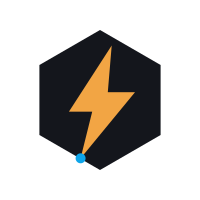

# ForgeVolt

**Where hardware, mechanical design, and firmware come together**

Hobbyist electronics builder — consoles, gadgets, and robots, from schematic to enclosure to firmware.

---

### What I build

Small electronic devices where hardware, mechanical design, and firmware come together as a single project — schematic, enclosure, and code, all open-sourced.

### Tech stack

*(Adjust the badges above to match the tools you actually use — this is a starting set.)*

### Featured projects

| Project | Description | Repo |
|---|---|---|
| ESPNowConnection | Paired, single-peer ESP-NOW links between two ESP32 boards | [link](https://github.com/forgevolt/ESPNowUtilities) |
| SoundEngine | Play short WAV sound effects on an ESP32 through an I2S DAC | [link](https://github.com/forgevolt/SoundEngine) |

### Follow the build

New projects and short build clips go up on [YouTube](https://youtube.com/@forgevolt). Full project files (schematics, enclosures, firmware) land here on GitHub.

---

Build. Test. Improve. Share.

